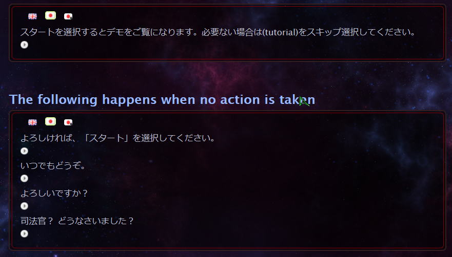

Welcome to this English and Japanese transcript of the "StarCraft® 1998" campaign!     
(property of Blizzard Entertainment®)

「StarCraft® 1998」キャンペーンの英語と日本語のトランスクリプト・文字起こしへようこそ！    
(Blizzard Entertainment® の所有物)


 - <a href="https://rodolphe-vaillant.fr/entry/131/starcraft-1998-japanese-transcript-terran-campaign"> Browse the latest version on my blog </a> (Terran campaign)



Original version is free to play or you can also buy the remaster:
https://starcraft.com/


Instructions
------------

I recommend using *vscode* to edit and view the files of this project.
You must launch `template.html` using a web server, otherwise Javascript code won't properly execute. 
The easiest way to setup a web server is to open the project with vscode and install the "Live Server" extension within vscode.
Then you can launch `template.html` with a right click ("Open to Live Server" menu). 

`template.html` should output the same as `terran.html`.
Don't edit `terran.html` as it is automatically generated content (copy paste from `template.html`). 
Contrary to `template.html` the file `terran.html` should not need a webserver, 
and can be opened as is for anyone to view offline.


Editing
-------

Set vscode to use tabs and not spaces

We name files `.htmlr` and not `.html` ->
this is to make custom shortcuts (added inside vscode) to only apply to the extension `.htmlr`

.HTMLR parsing
--------------

The transcript is divided into several `.htmlr` files.
Those will be parsed and put together to produce the final `.html` file with proper styling and functionalities.
For instance, play buttons for audio and icons to switch between languages will be added.
See parser.js for more details.

.HTMLR features
--------------------

`<pre> </pre>` tag  will preserve line returns

In a `.htmlr` you can use Markdown like lists:
- bla
- foo

It will be converted to html tags ul li.

You can use the syntax:  
```
漢字[かんじ]
```

Which will be converted to:  
```
    <ruby>漢字<rt>かんじ</rt></ruby>
```

this allows to display the furigana when hovering the kanji inside the browser.
note that you need a *space* before the kanji ' '漢字[かんじ] for the conversion to
happen, a tab or a wider character space won't do.
Sometimes I omit the space and only put a tab in front of 漢字[かんじ],
this is on purpose so it won't get converted to ruby syntax.


Editor setup
------------

To improve productivity I recommend:

 - Github copilot plugin
 - Html wrapper plugin
 - Code Spell Checker plugin (English pack etc)
 - Auto Rename Tag plugin
 - Auto close Tag plugin
 - Live Server plugin
 - For vscode:  setup: 'keybindings.json' to rapidly generate tags and class
 (manage -> Keyboard shortcuts then press icon to edit json)
  find an example of 'keybindings.json' in the root of this project.

Disclaimer
----------

The content: story, dialogues, audio, media, art, etc are all the sole propriety of Blizzard Entertainment®. 
I am not affiliated with Blizzard in any way, shape or form. This is purely made out of love for the game. I'm invoking the "fair use exception" for this work.

That being said I highly encourage you retribute the source material by buying the remastered version of the game
Although this endeavor took an enormous amount of time, this is a non-profit project, 
do not retribute me in any financial way for this work.

GitHub page
-----------

Alternate ways to browse the transcript:

- https://brainexcerpts.github.io/starcraft-transcripts/terran.html
- https://brainexcerpts.github.io/starcraft-transcripts/template.html (should reflect the latest state of the repo but for now broken)

Contributing
------------

See [todo list](todo.md)
